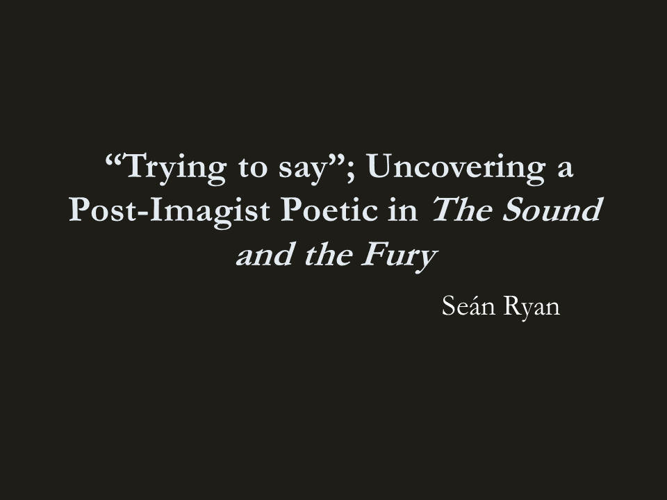
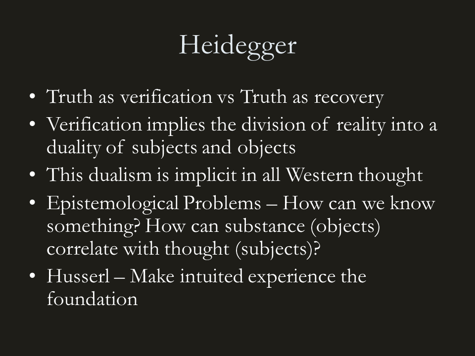
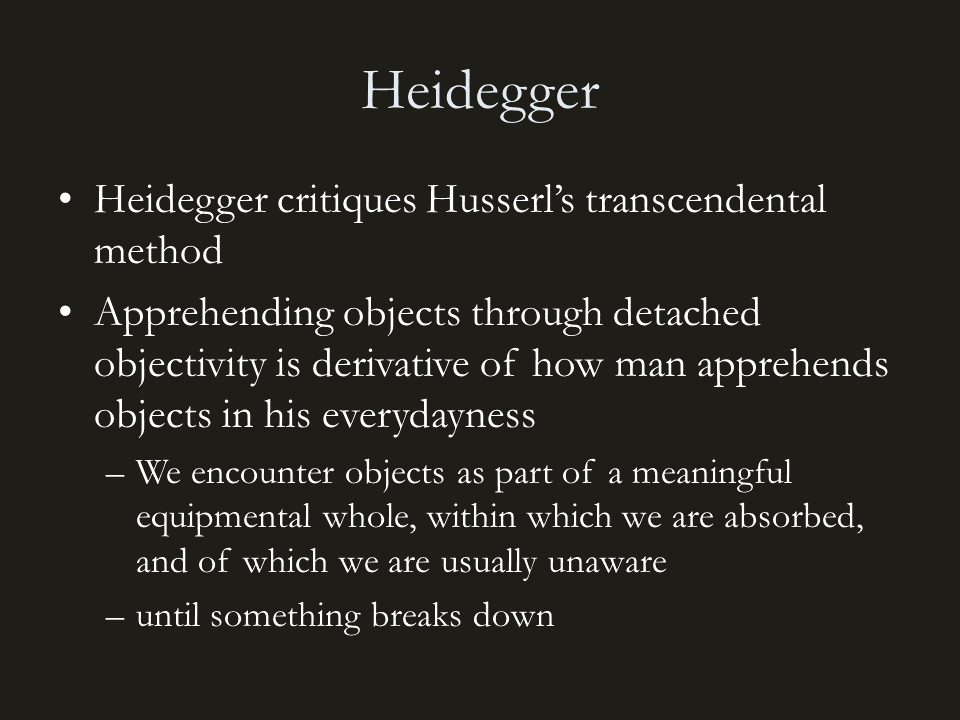
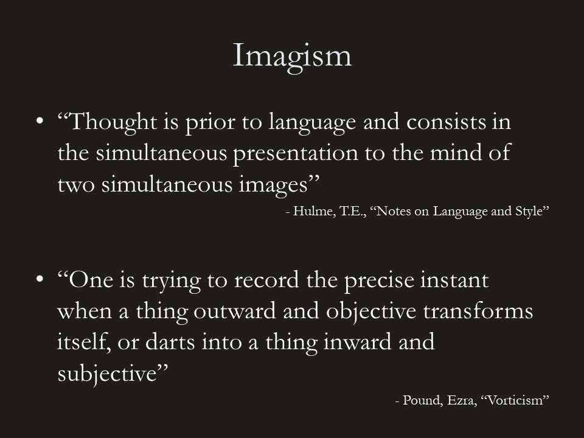
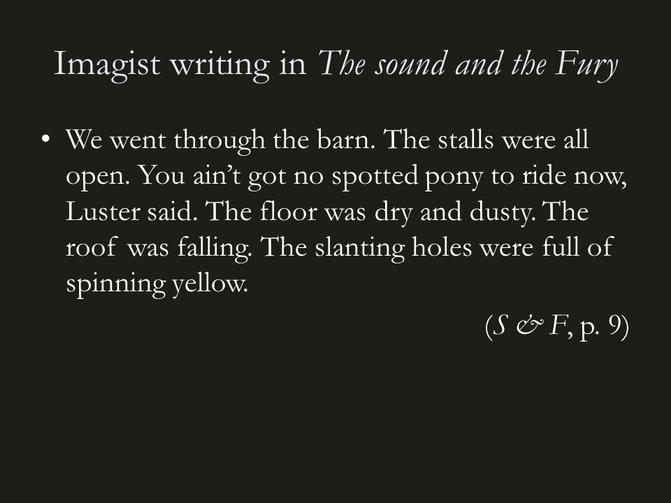
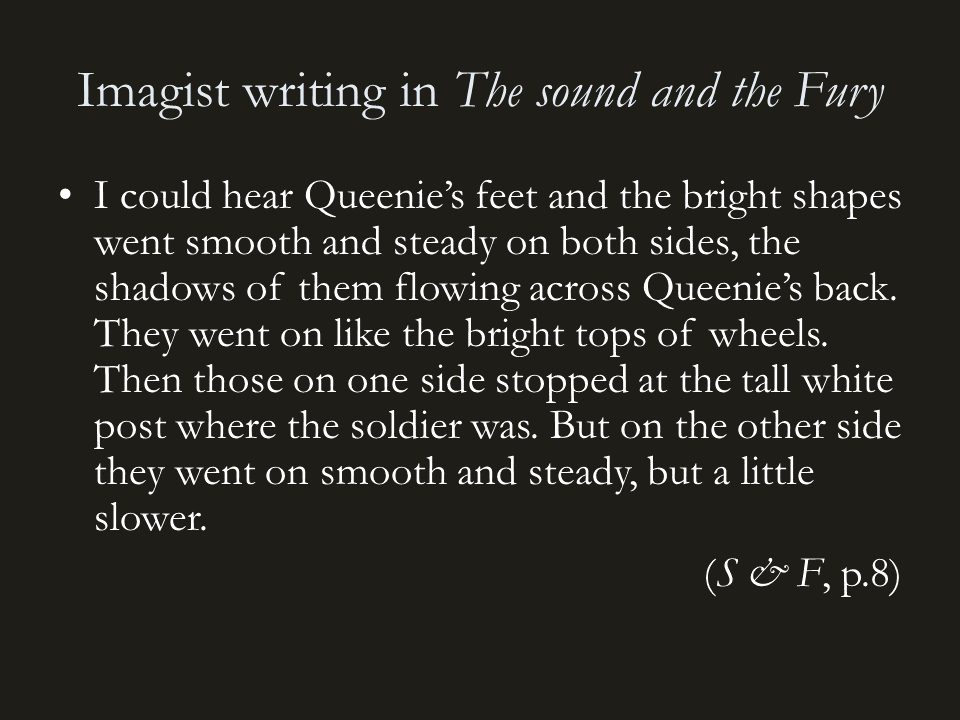
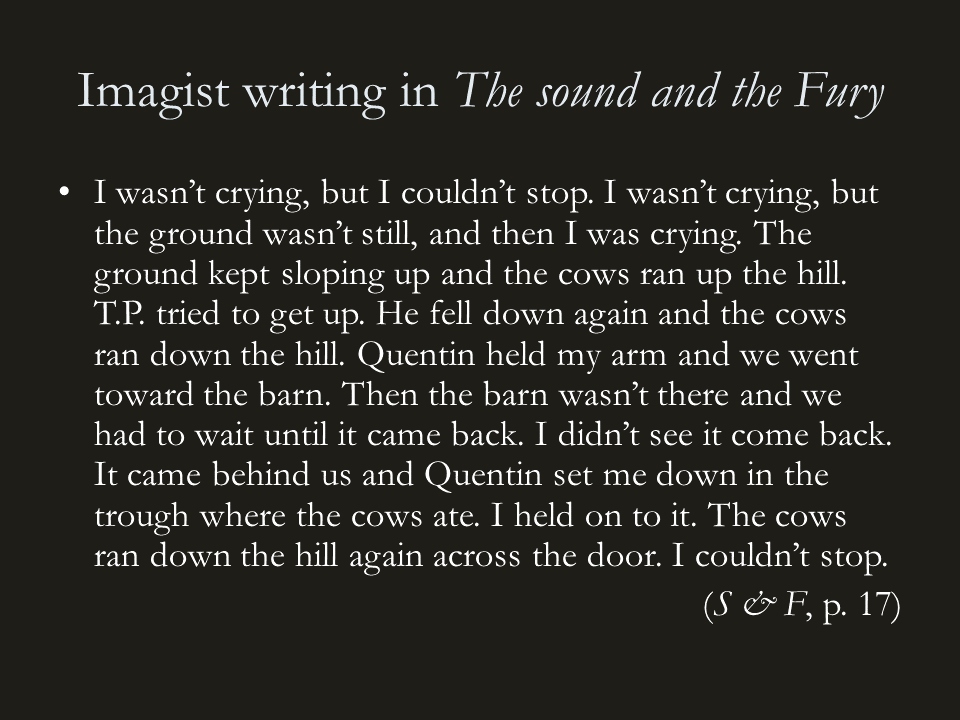
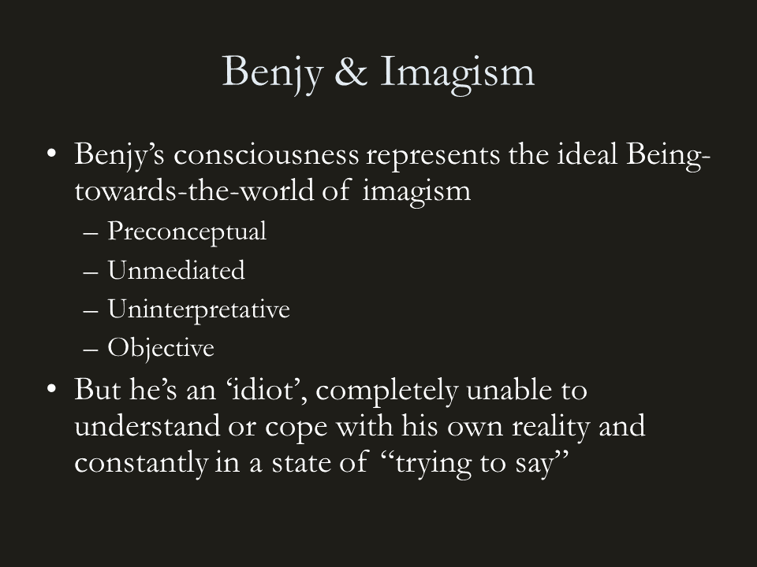
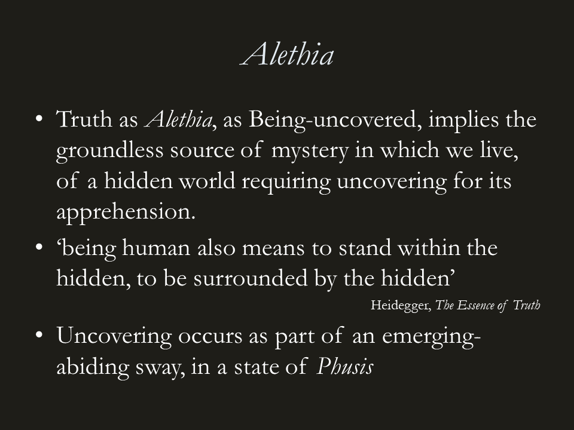
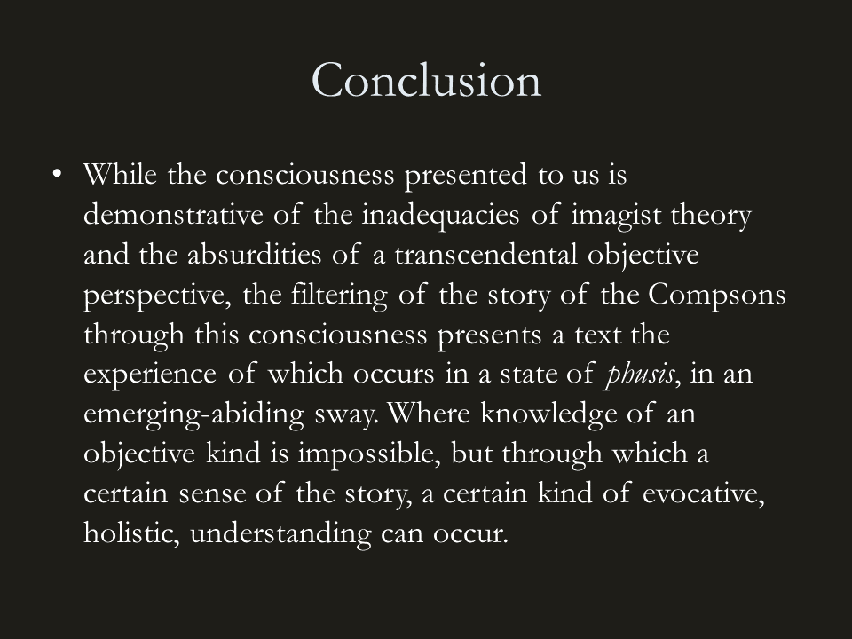

 ## Trying to say

The focus of my current research is a philosophical interpretation of the ‘Benjy’ section of William Faulkner’s The Sound and the Fury. The difficult experimental form implies an unarticulated, yet sophisticated, aesthetic and philosophical understanding of man, the world, and the relationships between them. It is a position that can be seen as grown out of imagism, but which ultimately rejects the Cartesian, transcendentalist grounds upon which this early modernist movement stood. Hand in hand with this implied critique of the imagist agenda and its ultimate failure to capture something essential of the human condition, the Benjy chapter plays a crucial role in the unfolding of the narrative of The Sound and the Fury in a particular form, a form that demonstrates a deeply profound and complex understanding of man in his world, his history and his story.

Imagist poetry, with its deep theoretical roots and its demand to be read from a posited theoretical stance, places itself within a position in which critique from other philosophical positions is permissible. Of course, imagist poetry can and should be read for its aesthetic qualities in and of themselves, but the vigour with which its proponents insisted it be read from a certain perspective demands that we approach that perspective with a critical bent, and for this paper, Martin Heidegger’s hermeneutic of the history of western thought provides a framework from which imagist attempts at authentic representation can be evaluated and understood. 

### Heidegger on transcendentalist philosophy

For Heidegger there has been a mistranslation of the Greek term for truth, Alethia. For the Greeks Alethia, truth, implied notions of recovery from some oblivion – un-hidden, un-covered, un-forgotten. However, translated into Latin truth loses its implication of activity and its source from the mystery of negation, and becomes veritas, implying verification, equivocation and correlativity between two separate dwellings for truth. This conception of truth carrying within it the supposition of a reality divided in two is a supposition that has infected all of western thought to this day. Heidegger debuilds this tradition and shows how the supposition of the separation of Being between the mental and the physical is demonstrable in all of European philosophy, from Descartes, to Kant and even Husserl.

This cleaving of our consciousnesses from the reality it occupies has resulted in a derelict metaphysics and the preponderance of immense epistemological problems in the philosophies of modernity, demanding questions such as how can we ever come to know something? How can a substantial world ‘out there’, made up of physical matter, correlate with representations ‘in here’, made up of thoughts? How can physical objects relate to mental content? Where is the connection between these that allows us to know the world? These questions become ever greater in the early years of the 20th Century as science, underpinned by a metaphysics of subjects and objects, comes to describe an external world that bears no relation to the world of intuited experience; a world where objects are 99% empty space and are unable to make contact, of multi-dimensional space-time and a colour spectrum of which we experience only a tiny fragment.

## Husserl's framework

Husserl’s answer to the epistemological problem was to take the intuited experience as the fundamental unit upon which to found knowledge. Whatever was to be said of how there could be equivalence between the world ‘out there’ and experiences ‘in here’, there was no doubting the validity of the experience in and of itself. Foundations of knowledge should begin from the indubitable starting point of direct experience in order to know reality and approach an understanding of ‘transcendental consciousness’. 

Though adopting Husserl’s phenomenological method, Heidegger critiques the Cartesian and transcendentalist implications inherent in his work. For him transcendental methodologies fail to achieve a full understanding of man’s Being-in-the-world as they insist on some form of calm, reposed, detached states through which the apprehension of the objects of external reality can be more objectively achieved. For Husserl there must be a stripping away or ‘bracketing off’ of received assumptions, ‘the natural attitude’, in order that our perception of reality can be brought closer to some transcendental objective truth. For Heidegger, this form of Being-towards-the-world is not the primordial state of consciousness that transcendentalists have intended it to be. Indeed it is a valid method of achieving a certain kind of knowledge, a certain kind of truth, what Heidegger would call ontic and useful to the sciences, but it is a form of Being-towards-the-world that is derivative to the more primordial Being-towards of man in his everydayness, a way of being that is very different from the methodologies of calm, reposed and introspective consciousness. 

### The World in our Everydayness

‘The world… is such that we do not in fact specifically occupy ourselves with it, or apprehend it, but instead it is so self-evident, so much a matter of course, that we are completely oblivious of it’. (Dreyfus, 90) In our everydayness the world presents a backdrop of which we pay little heed and upon which we pursue our more pressing concerns. It is only when our expectations of something breaks down that we are forced to go into an ontic mode of perception. For example, in our everyday activities we use the door handle without ever thematising it, its existence is predicated by its usefulness in our project – which in this case is leaving the room. In using the door handle, the observation of its location on the door, its appearance, its function and the motion our hand makes towards it are all one. In its use we are closer to the room on the other side than we are to the door handle itself in that we never decide to use the door handle, our decision is to leave the room. It is only when the door handle breaks down and our project is frustrated that we are forced to encounter the object in an ontic, detached state, breaking down our experience of it into constituent parts and processes.

Therefore, our primordial encounter of objects in our everydayness does not lie in subjective representations of an external objective reality, rather our encounter with objects occurs through an unthematised absorption in an equipmental whole; in a world of references and assignments, where objects gain meaning from the context of our own activities, our projects. This for Heidegger is our Being-in-the-world; objects are initially and primordially encountered in their meaning or use from within a context, and only afterwards, either in a moment of frustration or in an unnatural mode of detached, “objective” contemplation, can they be apprehended as pure substance, as pure presence. Thus it can be said that the apprehension of an object as an entity separate to our own subjective consciousness is derivative of a state in which our consciousness and the object are one.

And it is on this point that a Heideggerian critique of imagist poetic theory may lie.

### Imagism as Dualistic

Here are quotes from two of the fathers of the imagist school. In Hulme’s above we can decode an allusion to the assumption of correlativity between thought and object through representation, the image being a presented representation of a reality outside of the mind. In Pound’s below we find a mystification of the event of knowledge, terms such as transforms and darts do little to explain how correlativity between subjects and objects can occur, and leaves the epistemological problems inherent in the Cartesian world view not only unanswered, but mystified.

Transcendentalism, subject-object duality and the correlativity between language and reality are not just the assumptions underlying imagist theory; they are the point of departure of imagism, the very inspiration that motivates the imagist poet. Belief in a principle of equivalence between words and things inspires the imagist poet to re-create the experience of things out of words; a purist transcendental pursuit attaining to the most fundamental and primordial levels of the human condition when viewed in the light of Cartesian philosophy, but not from the perspective of Heideggerian phenomenological hermeneutics. 

Imagism loses sight of “worldliness”, of the nature of our Being-in-the-world and our primordial Being-towards-the-world. Imagist poetics is fundamentally concerned with a purified objective description of the thing itself, necessitating a primordial perception of the thing just on the cusp of a perspective purified of the corroding and malign influence of tradition. In Husserl’s terms, imagists hoped to ‘bracket off’ man’s ‘natural attitude’, to circumscribe the prejudices and preconceptions impeding our consciousness from a purified experience and allowing the achievement of an unmediated state of equivalence between the thing and the idea – a ‘presencing’ of the thing to consciousness. From this state of consciousness, from the modernising and making anew of our perceptions and language and the guarantee of equivalence between idea and thing, objective, thing-centred, imagist poetry could flow. But as Heidegger has shown, attempts at achieving an apprehension of presence, of pure objectivity, is a derivative state of Being-towards-the-world. While it may be one valid way of encountering the objects around us, useful to the sciences and to instrumental rationality, and maybe even for the production of a certain form of poetry, it is not the way man usefully goes about his everyday existence and certainly not the primordial way of facing and describing the world that imagist theory had supposed.

### An implied critique of imagism

And so we turn to of The Sound and the Fury. The presentation of Benjy’s consciousness in this novel poses many difficulties for the reader. His is a mind with no relationship to a language or a system of reference other than in the simplistic mode of suggestion, where the experience of specific sensations causes Benjy to experience something other. The smell of trees suggesting Caddy, getting caught on the fence as a 33 year old suggesting getting caught on the fence as a child and so on. The linguistically empty nature of Benjy’s mind implies that the stream of consciousness presented to us is in the novel is not his own, rather an interpretation of his mental states from some other, linguistic, perspective, - namely Faulkner’s. But most importantly, Benjy’s chapter presents a perspective that is almost entirely free of preconception. The mind Faulkner presents to his reader represents the imagist’s ideal for the writing of poetry; here is a primordial perception of reality, a transcendental perspective that apprehends the objects of the world in the purist sense; as uninterpreted, unmediated, presence. Benjy’s perception is one completely outside the corrosions and malign influences of tradition and this fact provides opportunities for some remarkably imagistic writing. 

> We went through the barn. The stalls were all open. You ain’t got no spotted pony to ride now, Luster said. The floor was dry and dusty. The roof was falling. The slanting holes were full of spinning yellow. (S & F, p. 9) 

The spinning yellow from the slanting holes here describes sunlight piercing through holes in the falling roof, or possibly refracting through the hay that has patched up the roof. Does this not follow the imagist remit of direct treatment of the “thing” and conciseness of language?

>I could hear Queenie’s feet and the bright shapes went smooth and steady on both sides, the shadows of them flowing across Queenie’s back. They went on like the bright tops of wheels. Then those on one side stopped at the tall white post where the soldier was. But on the other side they went on smooth and steady, but a little slower. (S & F, p.8)

Here we find a pure unmediated description of the experience of turning round a pillar in a horse and cart, Queenie here being the horse.

> I wasn’t crying, but I couldn’t stop. I wasn’t crying, but the ground wasn’t still, and then I was crying. The ground kept sloping up and the cows ran up the hill. T.P. tried to get up. He fell down again and the cows ran down the hill. Quentin held my arm and we went toward the barn. Then the barn wasn’t there and we had to wait until it came back. I didn’t see it come back. It came behind us and Quentin set me down in the trough where the cows ate. I held on to it. The cows ran down the hill again across the door. I couldn’t stop. (S & F, p. 17)

Here T.P. has made Benjy drunk, and the sensations of dizzying inebriation, being unable to maintain one’s balance or a sense of the direction of gravity is presented in terms of pure unmediated experience. Benjy is unable to understand the experience and requires a reader’s interpretative intervention to give it sense.

And here lies the crux. In Benjy’s experience of the world lies an implied critique of imagist theory. Faulkner pushes the transcendentalist agenda implicit in imagism to its extremes, extremes of total objectivity, of pre-conceptual and unmediated perception. Of course Benjy’s consciousness is a construct of Faulkner and any attempt to read his ‘condition’ as a genuine mental illness misses the point. The point is that, like Roquentin in Sartre’s Nausea, Benjy is completely unable to cope with his reality as man does in his everydayness. Faulkner, like Heidegger, establishes that the supposedly primordial mode of Being-towards-the-world that underpins Imagism, and any other “objective” school of thought, is an impossible one to maintain and shows us that the supremely imagist mind is actually the mind of an incapable ‘idiot’.

### Alethia

However, though the Benjy chapter presents a mode of Being-towards-the-world that is derivative of our everydayness, the text can be seen as constituting the site of an authentic disclosure of narrative, or world. I spoke at the beginning of this paper of two understandings of truth, truth as verification between a subjective thought with an objective reality, and truth as Being-uncovered, as recovery from some oblivion. This conception of truth as Being-uncovered implies the groundless source of mystery of our reality, of a covered world requiring uncovering for its apprehension. 

Heidegger believes the early Greeks, who did not ground the nature of reality in constant presence, experienced the world not as a collection of substances to be apprehended by consciousness or perception, but as a groundless source of mystery into which we are thrown and with which we take part. The primordial nature of our encounter the world is in a state of phusis, our apprehension of which has degenerated into an understanding of world as ‘nature’, a collection of substances to be objectively analysed, conceptualised, and known. Phusis, in Heidegger’s terms, means everything that “comes-into-presence,” that unfolds itself to us in our apprehension, does so in an emerging-abiding sway. This relationship of emergence and abidance tells us that what stands before us in our apprehension, conceals that which stands behind it, in a sway between the hidden and the un-hidden.

### Faulkner’s uncovering of world in the mode of 'Alethia'

And so it could be said that the reader’s first experience of the Benjy chapter occurs in this state of phusis, in a state of emergence and abidance. It is difficult for the reader to know much of what is going on in the chapter as events, sensations and time kaleidoscopes together. It is very difficult to arrive at objective knowledge of the Compson’s story filtered as it is through Benjy’s consciousness. Even character’s names refuse to offer the consolation of a fixed referentiality, as the shifting significations ‘Quentin’ and ‘Maury’ show. 

But as the Benjy chapter yields little in the way of the discernable, the knowable, of the Compson’s story, it offers a rich sense of their narrative, conveying textures, moods, prejudices, dynamics between personalities and so forth. We emerge from the confusion of the text with a certain kind of understanding that could not be achieved with more conventional narrative techniques. What Hugh Kenner calls a withholding of information in Faulkner’s aesthetic is in fact a demonstration of the kind of emerging-abiding sway in which we come to apprehend our own stories, our own world.
 

While the consciousness presented to us is demonstrative of the inadequacies of imagist theory and the absurdities of a transcendental objective perspective, the filtering of the story of the Compsons through this consciousness presents a text the experience of which occurs in a state of phusis, in an emerging-abiding sway. Where knowledge of an objective kind is impossible, but through which a certain sense of the story, a certain kind of evocative, holistic, understanding can occur. 

Thank you
